<h1 align="center">
  
</h1>

  &nbsp;
  &nbsp;
  &nbsp;
  

---

### 🧑‍💻 About Me

B.Tech CS grad who loves building things end-to-end — from scalable web backends to real-time game systems to RL agents that learn to play Snake. Currently shipping an indie action-survival title in Unity while freelancing as a full-stack developer.

- 🎮 **Building:** An indie action-survival game — combat AI, inventory/crafting, save/load, the whole pipeline
- 🔬 **Published:** Research on deep learning + multi-view geometry for object detection *(JISEM, 2025)*
- 🏆 **Won:** Best Startup Potential — Technovate 2025
- 🌍 **Studied across 3 continents:** India · London · New Jersey

---

### 🛠️ Tech Stack

  

  

  

  

---

### 🚀 Selected Projects

<table>
  <tr>
    <td width="50%" valign="top">
      <h3>🎮 Survival Action Game</h3>
      
<strong>Unity · C# · State Machines · Addressables</strong>

      
Indie title with real-time combat, enemy AI (patrol/chase/attack), loot, inventory/crafting, quests, and save/load. Addressables cut load times ~30–40%. Sustained 60+ FPS with 20+ active NPCs. Playtested with 15 players — session length up ~25% after balance pass.

    </td>
    <td width="50%" valign="top">
      <h3>🐍 Snake AI Trainer</h3>
      
<strong>Python · PyTorch · Double DQN · FastAPI/WebSocket</strong>

      
RL agent outperformed rule-based baseline by ~2–3× after 500k+ steps. Prioritized replay + target network improved sample efficiency ~1.3×. Live dashboard with reward/loss charts. Inference ~2–5 ms/step CPU-only.

    </td>
  </tr>
  <tr>
    <td width="50%" valign="top">
      <h3>🎬 Video Editor</h3>
      
<strong>FFmpeg · GPU (NVENC/AV1)</strong>

      
Timeline-based desktop tool: drag-drop, ripple trim, snap, markers. Copy-stream export: 30-min timeline → output in &lt;60s. GPU mode cuts re-encode time ~50–70%. Processed 100+ clips (~8–10 hrs) in testing.

    </td>
    <td width="50%" valign="top">
      <h3>💬 WhatsApp Itinerary Bot</h3>
      
<strong>Node.js · Twilio API · LLM/Groq · MySQL</strong>

      
Built at ULAVI Technologies (Singapore). LLM-powered travel itinerary bot on WhatsApp with Twilio integration, MySQL backend, and ngrok for secure local testing.

    </td>
  </tr>
</table>

> 📂 **More projects →** [github.com/PrakritTyagi123?tab=repositories](https://github.com/PrakritTyagi123?tab=repositories)

---

### 📊 GitHub Stats

<!-- These are generated by the metrics.yml workflow and committed to this repo -->

  

### 📅 Isometric Commit Calendar

  

### 🔥 Streak Stats

  <picture>
    <source media="(prefers-color-scheme: dark)" srcset="https://streak-stats.demolab.com?user=PrakritTyagi123&theme=tokyonight&hide_border=true" />
    <source media="(prefers-color-scheme: light)" srcset="https://streak-stats.demolab.com?user=PrakritTyagi123&theme=default&hide_border=true" />
    
  </picture>

---

### 🐍 Contribution Snake

  <picture>
    <source media="(prefers-color-scheme: dark)" srcset="https://raw.githubusercontent.com/PrakritTyagi123/PrakritTyagi123/output/github-snake-dark.svg" />
    <source media="(prefers-color-scheme: light)" srcset="https://raw.githubusercontent.com/PrakritTyagi123/PrakritTyagi123/output/github-snake.svg" />
    
  </picture>

---

  

